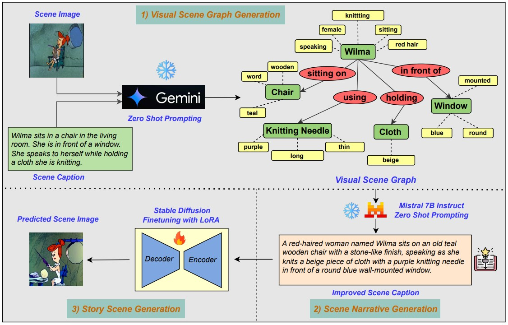
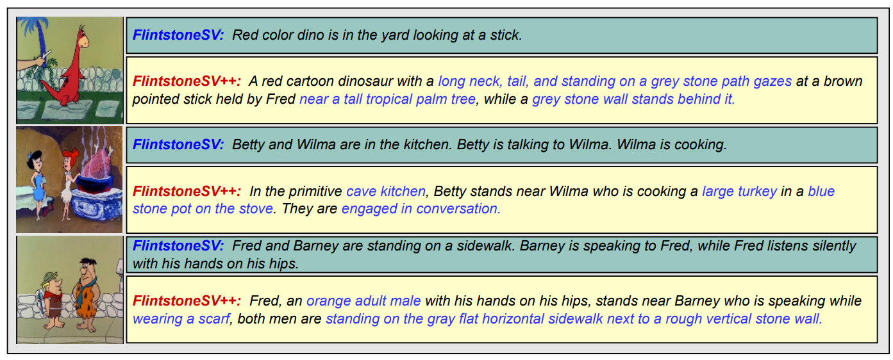
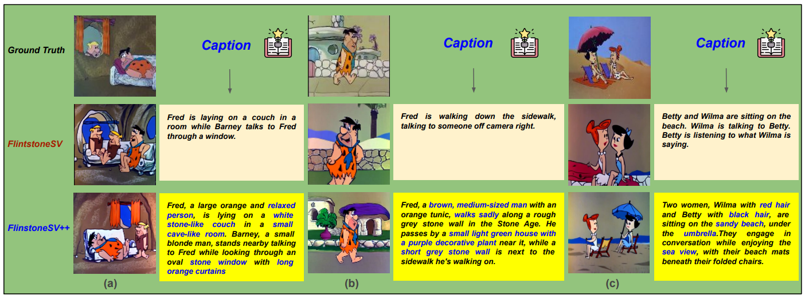

# 🚀🚀🚀 FlintstonesSV++: Improving Story Narration using Visual Scene Graph

**Paper Title:** [FlintstonesSV++: Improving Story Narration using Visual Scene Graph](https://drive.google.com/file/d/1FszLRLLoqRqp06pqtD5wzsiPMHHN95pi/view?usp=drive_link)  
**Accepted at:** Text2Story Workshop, ECIR Conference 2025, Lucca, Italy.  
**Authors**: *Janak Kapuriya*, *Paul Buiteelar* \
**Organization:** Insight SFI Research Center for Data Analytics, University of Galway, Ireland.

---

## FlinststonesSV++ Dataset
- 🤗🤗🤗 [Huggingface Link](https://huggingface.co/datasets/Janak12/FlintstonesSV_Plus_Plus)

---

## 🌟 Overview

- The **FlintstonesSV++** dataset enhances the original **FlintstonesSV** dataset by integrating **Visual Scene Graphs** and **Large Language Models (LLMs)** to improve story narration. 
- This enriched dataset introduces a more accurate and contextually improved method of generating scene narratives, aimed at advancing narrative-based AI applications.

---

## 🔄 Three-Step Methodology of FlintstonesSV++

### 1) **Visual Scene Graph Generation**  
The first step involves feeding the scene image and caption into the **Gemini-Flash** model, which generates a **Visual Scene Graph**. The graph visually represents the story, where:
- **Green boxes** represent **Objects**  
- **Yellow boxes** represent **Attributes**  
- **Red circles** represent **Relationships** between the objects

### 2) **Scene Narrative Generation**  
Using the **Visual Scene Graph**, the **Mistral-7B LLM** generates an improved scene caption. This process leverages zero-shot prompting to enhance the narrative with more detailed and accurate descriptions based on the visual context.

### 3) **Story Scene Generation**  
Finally, we use fine-tuned **Stable Diffusion models** and the **LoRA** technique to generate a new **Scene Image** based on the enhanced scene caption.

---

## 📊 Dataset Details

| Split       | Size   |
|-------------|--------|
| **Train**   | 20,132 |
| **Validation** | 2,071  |
| **Test**    | 2,309  |

---

## 🔍 Dataset Composition
Each sample in **FlintstonesSV++** includes the following:
- **id:** A unique identifier for the sample.  
- **flintstonesSV_image_id:** Matches the original **FlintstonesSV** dataset.  
- **image:** The scene image.  
- **text:** The improved scene narrative generated using our Visual Scene Graph and LLM-based approach.

---

## 🖼️Qualitative Comparison between FlintstonesSV++ and FlintstonesSV

- The image above shows the comparison between the **FlintstonesSV++** and **FlintstonesSV** datasets.
- The blue-highlighted text in **FlintstonesSV++** represents additional **factual information extracted through our visual scene graph-based approach**, which is missing in the original **FlintstonesSV** dataset.

---

## 🎨🎨Text-to-Image Generation Results

| **Dataset**            | **SDXL Base 1.0**        |                       | **Stable Diffusion V4**      |                       | **Stable Diffusion 2**       |                       |
|-------------------------|--------------------------|-----------------------|------------------------------|-----------------------|------------------------------|-----------------------|
|                         | **CLIP (↑)**            | **FID (↓)**           | **CLIP (↑)**                | **FID (↓)**           | **CLIP (↑)**                | **FID (↓)**           |
| **FlintstonesSV**       | 0.2727                  | 77.72                 | 0.2841                      | 52.02                 | 0.2958                      | 42.18                 |
| **FlintstonesSV++**     | **0.3350**                  | **63.36**                 | **0.3326**                      | **49.87**                 | **0.3436**                      | **41.52**                 |

By fine-tuning text-to-story generation models on **FlintstonesSV++**, we demonstrate substantial improvements:
- A **5.2%** average increase in alignment scores.
- A **5.72%** boost in image generation quality compared to models trained on the original **FlintstonesSV** dataset.

---

## 🔮🔮Predicted Results Comparison between FlintstonesSV++ and FlintstonesSV

- This image shows the comparison of ground truth scene images and generated scene images produced by fine-tuned diffusion models for scene **narrative-to-image** generation.
- The **blue** color in the text **highlights factual information added by our visual scene graph approach**.

---

## 🚀🚀 Why FlintstonesSV++?

**FlintstonesSV++** significantly enhances the quality of scene narratives, making it an invaluable resource for narrative-based AI applications.

---

## 📬 Get in Touch

Feel free to reach out if you have any questions or suggestions!

**Janak Kapuriya**  
📧 Email: [janakkumnar.kapuriya@insight-centre.org](mailto:janakkumnar.kapuriya@insight-centre.org)
